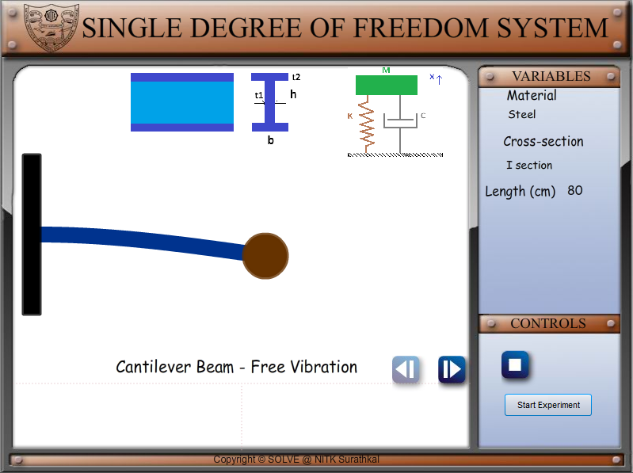
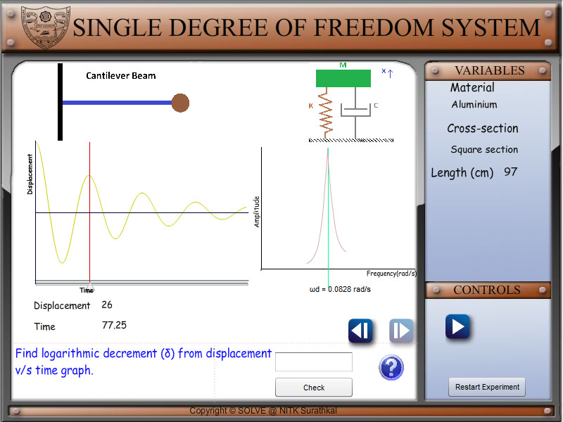
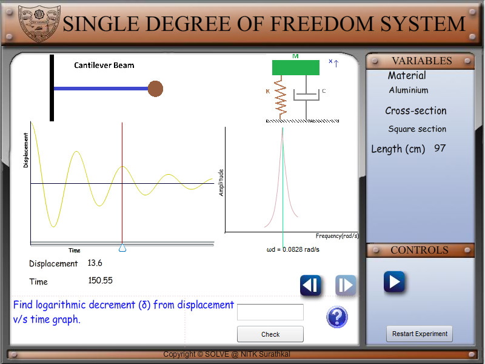
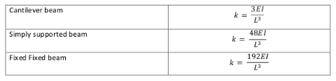
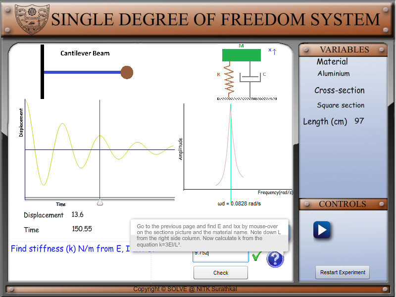
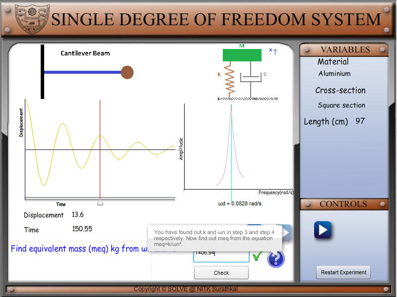

**AIM**:  
To find the damping (c) of the given beam.

**PROCEDURE**:
Begin the experiment by clicking the start experiment button.  

1. Find logarithmic decrement ( δ) from displacement v/s time graph. The logarithmic decrement is defined as follows.

Here x1 and xn refer to the displacements at the first and nth peak in the displacement v/s time graph.
The displacements at the peaks can be found using the location slider.

2. Find the damping ratio (ζ) from the logarithmic decrement (δ). The damping ratio is given by

3. Find beam stiffness (k) N/m from Young's modulus (E), area moment of inertia (I) and length (L). The stiffness for different beams is given below

4. Find natural frequency (ωn) rad/s from ωd and ζ  
   ωd can found from the FFT in the graph

5. Find equivalent mass (meq) kg from ωn and k.

6. Find critical damping (cc) Ns/m frommeq and k.  
   

7. Find damping (c) Ns/m from cc and ζ.  
   

   

**RESULT**:  
System damping c has been found. The basic concepts in free vibration of SDOF systems are covered.

