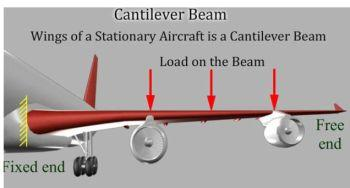
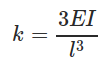
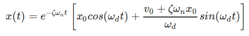
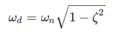

**Learning Objectives**

After completing this simulation experiment on free vibration of a cantilever beam one should be able to:

- Model a given real system to an equivalent simplified model of a cantilever beam with suitable assumptions / idealizations.
- Calculate the logarithmic decrement, damping ratio, damping frequency and natural frequency of the system
- Find the stiffness and the critical damping of the system.
- Calculate damping coefficient of the system.

**Introduction**

A system is said to be a cantilever beam system if one end of the system is rigidly fixed to a support and the other end is free to move. A real system is shown below, try to make suitable assumptions to deduce the system to a cantilever beam.

An aircraft wing as a cantilever beam

Vibration analysis of a cantilever beam system is important as it can explain and help us analyse a number of real life systems. As shown in above examples, real systems can be simplified to a cantilever beam, thereby helping us make design changes accordingly for the most efficient systems.

**Natural Frequency of Cantilever Beam**

When given an excitation and left to vibrate on its own, the frequency at which a cantilever beam will oscillate is its natural frequency. This condition is called Free vibration. The value of natural frequency depends only on system parameters of mass and stiffness. When a real system is approximated to a simple cantilever beam, some assumptions are made for modelling and analysis (Important assumptions for undamped system are given below):

- The mass (m) of the whole system is considered to be lumped at the free end of the beam
- No energy consuming element (damping) is present in the system i.e. undamped vibration
- The complex cross section and type of material of the real system has been simplified to equate to a Cantilever beam

The governing equation for such a system (spring mass system without damping under free vibration) is as below:

k the stiffness of the system is a property which depends on the length (l), moment of inertia (I) and Young's Modulus (E) of the material of the beam and for a cantilever beam is given by:

**Damping in a Cantilever Beam**

Although there is no visible damper (dashpot) the real system has some amount of damping present in it. When a system with damping undergoes free vibration the damping property must also be considered for the modeling and analysis.

Single degree of freedom mass spring damper system under free vibration is governed by the following differential equation:

c is the damping present in the system and ζ is the damping factor of the system which is nothing but ratio of damping c and critical damping cc. Critical damping can be seen as the damping just sufficient to avoid oscillations. At critical condition ζ=1. For real systems the value of ζ is less than 1. For system where ζ < 1 the differential equation solution is a pair of complex conjugates. The displacement solution is given by

where x0 and v0 are initial displacement and velocity and ωd is the damped natural frequency of the system. The damped natural frequency is calculated as below:

