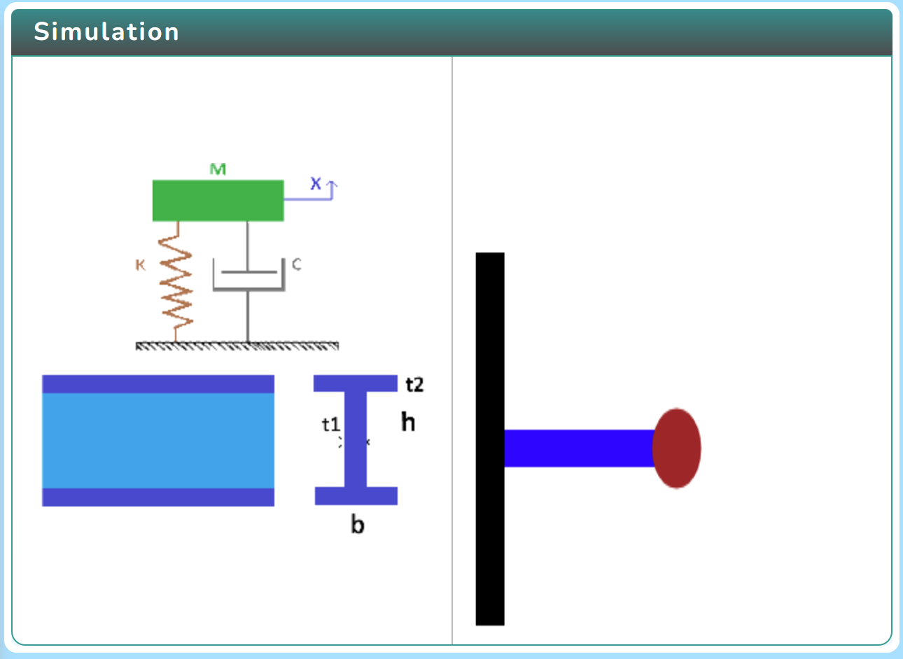
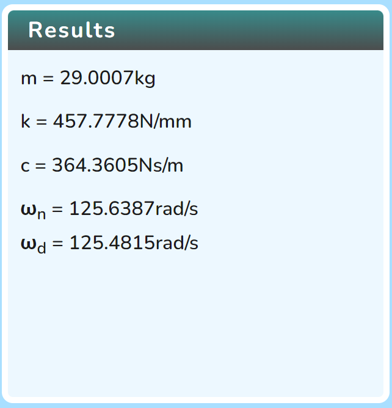
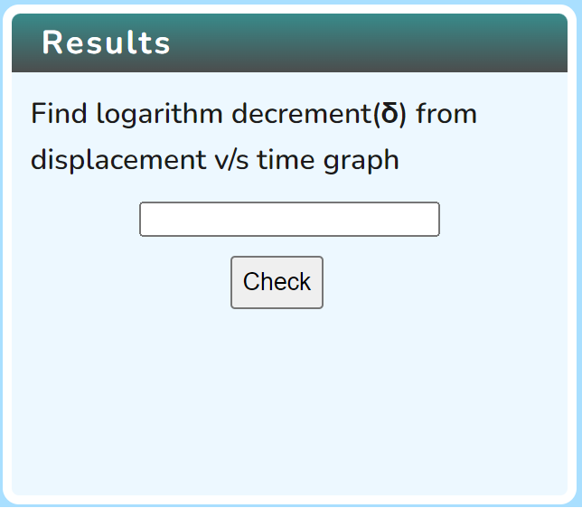
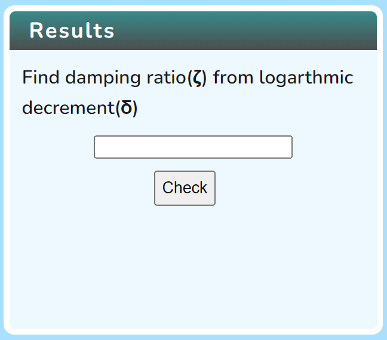
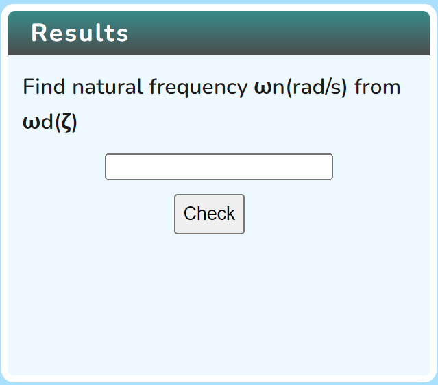

## Procedure

### User Interface

  Click on the Simulation icon      to view the simulation screen. 

   
   
   In order to view the variable section click on the Variable icon. 

   

   In order to view the result section click on the Result icon. 

  

   Click on Play icon  to run the simulation and click on Pause icon  to stop it.
   
    
Click on the Graph icon   to view the graph.    
  

### expR 

1. Find the results of Free vibration of cantilever beam.
   
    

### expT. Experiment 1

1. Find the logarithmic decrement ( δ) from displacement v/s time graph enter the input values and then click on the "Check" button. 

 

### expT. Experiment 2

1. Find the damping ratio(ζ) from logarthmic decrement(δ) enter the input values and then click on the "Check" button. 

### expT. Experiment 3

1. Find natural frequency ωn(rad/s) from ωd(ζ) enter the input values and then click on the "Check" button.

